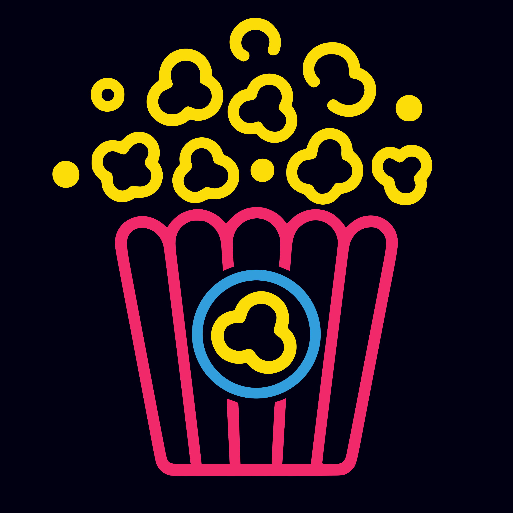
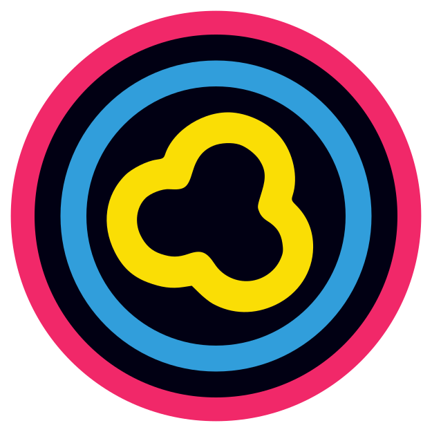

# Brand Style Guide

## Brand Overview

A vibrant, modern cinema brand that combines nostalgic movie theater elements
with bold neon aesthetics. The popcorn imagery serves as the core visual
identity, representing entertainment, fun, and the classic cinema experience.

---

## Quick Reference

| Element         | Value                                                                               |
| --------------- | ----------------------------------------------------------------------------------- |
| Primary Color   |  `#f12869` (Neon Pink)      |
| Secondary Color |  `#319edb` (Electric Blue)  |
| Accent Color    |  `#fade05` (Buttery Yellow) |
| Background      |  `#010013` (Midnight Navy)  |
| Border Radius   | 8-24px                                                                              |
| Font Family     | Montserratm Inter                                                                   |
| Grid System     | 8px base unit                                                                       |

---

## Color Palette

**Midnight Navy**

-  `#010013`
- Usage: Primary background, dark surfaces
- Purpose: Creates dramatic contrast and premium feel
- Accessibility: Use with light text only

**Neon Pink**

-  `#f12869`
- Usage: Primary brand color, CTAs, headers
- Purpose: High energy, attention-grabbing, playful
- Accessibility: Ensure sufficient contrast on dark backgrounds

**Electric Blue**

-  `#319edb`
- Usage: Secondary accent, highlights, links
- Purpose: Supporting color, provides visual variety
- Accessibility: Good for interactive elements

**Buttery Yellow**

-  `#fade05`
- Usage: Accents, icons, highlights, popcorn elements
- Purpose: Warmth, optimism, classic cinema association
- Accessibility: Use thoughtfully on dark backgrounds

### Color Combinations

- **Hero sections**: Midnight Navy background with Neon Pink headlines and
  Buttery Yellow accents
- **Cards/Components**: Midnight Navy with Electric Blue borders and Neon Pink
  CTAs
- **Interactive states**: Electric Blue for hover, Buttery Yellow for
  active/selected

---

## Logo Usage

### Primary Logo (Popcorn Box)

- Use on landing pages, marketing materials, and main headers
- Minimum size: 180px width
- Backgrounds: Works best on Midnight Navy or dark surfaces

### Icon/Favicon (Popcorn Kernel)

- Use for app icons, favicons, social media profiles
- Works standalone without text

### Logo Don'ts

- Don't change the colors
- Don't rotate or skew
- Don't add effects or shadows
- Don't place on busy backgrounds
- Don't stretch or compress

---

## Typography

### Recommended Font Pairings

**Display/Headers**

- Font: Montserrat Bold (https://fonts.google.com/specimen/Montserrat)
- Use for: Headlines, hero text, section titles
- Style: All caps or sentence case
- Color: Neon Pink or Buttery Yellow

**Body Text**

- Font: Inter (https://fonts.google.com/specimen/Inter)
- Use for: Paragraphs, descriptions, UI text
- Style: Regular weight, 400-500
- Color: White (#FFFFFF) or light gray (#E5E5E5)

**Accent Text**

- Font: Same as display, lighter weight
- Use for: Labels, captions, metadata
- Style: Medium weight, uppercase
- Color: Electric Blue or Buttery Yellow

### Type Scale

- Hero/H1: 48-72px
- H2: 36-48px
- H3: 24-32px
- Body: 16-18px
- Small/Caption: 12-14px

---

## Visual Style

### Aesthetic Direction

- **Neon nostalgia**: Modern take on classic cinema
- **High contrast**: Dark backgrounds with vibrant accents
- **Playful energy**: Fun, approachable, exciting
- **Clean simplicity**: Bold colors without clutter

### Design Elements

**Rounded Corners**

- Buttons: 8-12px border radius
- Cards: 16-24px border radius
- Maintain consistent rounding throughout

**Glow Effects**

- Subtle neon glow on hover states
- Use sparingly for emphasis
- CSS: `box-shadow: 0 0 20px rgba(241, 40, 105, 0.5)`

**Icons**

- Line style: Rounded, 2-3px stroke weight
- Matches logo aesthetic
- Color: Electric Blue or Buttery Yellow

---

## Tone of Voice

### Brand Personality

- **Enthusiastic**: Excited about movies and entertainment
- **Approachable**: Friendly and welcoming to all
- **Nostalgic**: References classic cinema culture
- **Modern**: Contemporary and fresh perspective

### Writing Style

- Use conversational, upbeat language
- Short, punchy sentences
- Action-oriented CTAs
- Pop culture references when appropriate
- Avoid overly technical jargon

### Example Copy

- "Grab your popcorn and settle in"
- "Now showing: Your next favorite film"
- "Lights, camera, action!"

---

## Application Examples

### Digital

- Website hero sections with neon glow effects
- Mobile app with icon as app launcher
- Social media posts with brand colors
- Email newsletters with popcorn motifs

### Print

- Movie tickets with neon color scheme
- Posters with high contrast design
- Loyalty cards featuring icon
- Merchandise: T-shirts, stickers, cups

### Motion

- Animated popcorn popping
- Neon glow pulsing effects
- Color transitions between brand colors
- Loading states with kernel animation
